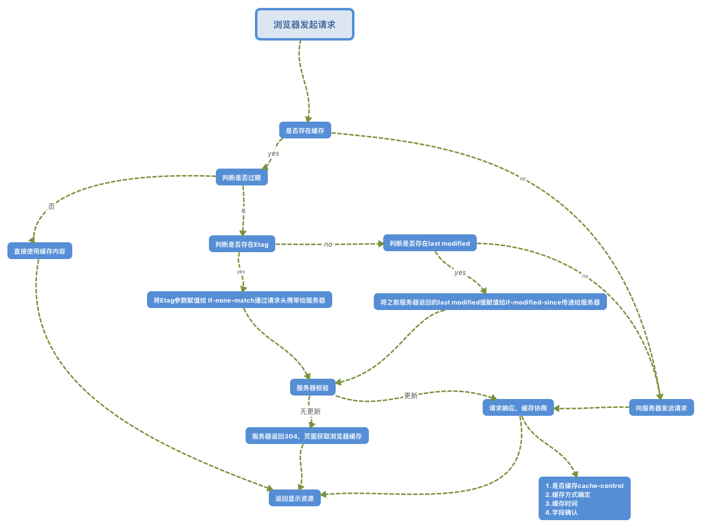

# 浏览器http缓存

### 浏览器http缓存大致流程图


### 缓存种类
1. 浏览器缓存
    - 浏览器对于缓存的处理是根据第一次请求资源时返回的响应头来确定的。
2. 代理服务器缓存
3. 网关缓存
4. 数据库缓存


### 通用首部字段
#### cache-control

##### 缓存请求指令

<table>
  <thead>
    <tr>
        <th>指令</th>
        <th>参数</th>
        <th>说明</th>
    </tr>
  </thead>
  <tbody>
    <tr>
      <td>no-cahce</td>
      <td>无</td>
      <td>强制向源服务器再次验证</td>
    </tr>
    <tr>
      <td>no-store</td>
      <td>无</td>
      <td>不缓存请求或响应的任何内容</td>
    </tr>
    <tr>
      <td>max-age = [秒]</td>
      <td>必需</td>
      <td>期望在指定时间内的响应仍有效</td>
    </tr>
    <tr>
      <td>max-state( = [秒])</td>
      <td>可省略</td>
      <td>接收已过期的响应</td>
    </tr>
    <tr>
      <td>min-fresh = [秒]</td>
      <td>必需</td>
      <td>期望在指定时间内发响应仍有效</td>
    </tr>
    <tr>
      <td>no-transform</td>
      <td>无</td>
      <td>代理不可更改媒体类型</td>
    </tr>
    <tr>
      <td>only-if-cached</td>
      <td>无</td>
      <td>从缓存获取资源</td>
    </tr>
    <tr>
      <td>cache-extension</td>
      <td>-</td>
      <td>新指令标记[token]</td>
    </tr>
  </tbody>
</table>

##### 缓存响应指令

<table>
  <thead>
    <tr>
        <th>指令</th>
        <th>参数</th>
        <th>说明</th>
    </tr>
  </thead>
  <tbody>
    <tr>
      <td>public</td>
      <td>无</td>
      <td>可向任意方提供响应的缓存</td>
    </tr>
    <tr>
      <td>private</td>
      <td>可省略</td>
      <td>仅向特定用户返回响应</td>
    </tr>
    <tr>
      <td>no-cahce</td>
      <td>可省略</td>
      <td>缓存前必需先确认其有效性</td>
    </tr>
    <tr>
      <td>no-store</td>
      <td>无</td>
      <td>不缓存请求或响应的任何内容</td>
    </tr>
    <tr>
      <td>no-transform</td>
      <td>无</td>
      <td>代理不可更改媒体类型</td>
    </tr>
    <tr>
      <td>must-revalidate</td>
      <td>无</td>
      <td>可缓存但必须再想源服务器进行确认</td>
    </tr>
    <tr>
      <td>proxy-revalidate</td>
      <td>无</td>
      <td>要求中间缓存服务器对缓存的响应有效性再进行确认</td>
    </tr>
    <tr>
      <td>max-age = [秒]</td>
      <td>必需</td>
      <td>响应的最大Age值</td>
    </tr>
    <tr>
      <td>s-maxage = [秒]</td>
      <td>必需</td>
      <td>公共缓存服务器响应的最大Age值</td>
    </tr>
    <tr>
      <td>cache-extension</td>
      <td>-</td>
      <td>新指令标记[token]</td>
    </tr>
  </tbody>
</table>

##### 表示是否能缓存的指令

public指令

`Cache-Control: public` 
> 当使用public指令时，则明确表明其他用户也可利用缓存。

private指令

`Cache-Control: private` 
> 当使用private指令时，响应只以特定的用户作为对象，这与public指定的行为相反。
> 缓存服务器会对该特定用户提供资源缓存的服务，对于其他用户发送过来的请求，代理服务器则不会返回缓存

no-cache指令

`Cache-Control: no-cache`
> 使用no-cache指令的目的是为了防止从缓存中返回过期的资源。
> 客户端发送的请求如果包含no-cache指令，则表示客户端将不会缓存过的响应。于是，“中间”的缓存服务器必须把客户端请求转发给源服务器。如果服务器返回的响应中包含no-cache指令，那么缓存服务器不能对资源进行缓存。源服务器以后也将不再对缓存服务器请求中提出的资源有效性进行确认，且禁止其对响应资源进行缓存操作。

no-store指令

`Cache-Control: no-store`
> 当使用no-store指令时，暗示请求（和对应的响应）或响应中包含机密信息。因此，该指令规定缓存不能再本地存储请求或响应的任一部分。

s-maxage指令
`Cache-Control: s-maxage=604800 (单位 ：秒)`
> s-maxage指令的功能和max-age指令的相同，他们的不同点是s-maxage指令适用于供多位用户使用的公共缓存服务器。

max-age指令

`Cache-Control: max-age = 604800 (单位 ：秒)`
> 当客户端发送的请求中包含max-age指令时，如果判定缓存资源的缓存时间数值比指定时间的数值更小，那么客户端就接收缓存的资源。另外，当指定max-age值为0，那么缓存服务器通常需要将请求转发给源服务器。

> 当服务器返回的响应中包含max-age指令时，缓存服务器将不对资源的有效性再作确认，而max-age数值代表资源保存为缓存的最长时间。

> 应用HTTP/1.1版本的缓存服务器遇到同时存在Expires首部字段的情况时，会优先处理max-age指令，而忽略掉Expires首部字段。而HTTP/1.0版本的缓存服务器的情况却相反，max-age指令会被忽略掉。

min-fresh指令

`Cache-Control: min-fresh=60(单位：秒)`
> min-fresh指令要求缓存服务器返回至少还未过指定时间的缓存资源。比如，当指定min-fresh为60秒后，在这60秒以内如果有超过有效期限的资源都无法作为响应返回了。

max-stale指令

`Cache-Control:max-stale=3600(单位：秒）`
> 使用max-stale可指示缓存资源，即使过期也照常接收。

> 如果指令未指定参数值，那么无论经过多久，客户端都会接收响应；如果指令中指定了具体数值，那么即使过期，只要扔处于max-stale指定的时间内，仍旧会被客户端接收。

only-if-cached指令

`Cache-Control: only-if-cached`
> 使用only-if-cached指令表示客户端仅在缓存服务器本地缓存目标资源的情况下才会要求其返回。换言之，该指令要求缓存服务器不重新加载响应，也不会再次确认资源有效性。若发生请求缓存服务器的本地缓存无响应，则返回状态码504 Gateway Timeout。

must-revalidate指令

`Cache-Control: must-revalidate`
> 使用must-revalidate指令，代理会向源服务器再次验证即将返回的响应缓存目前是否仍然有效。

> 若代理无法连通源服务器再次获取有效资源的话，缓存必须给客户端一条504（Gateway Timeout）状态码。

> 另外，使用must-revalidate指令会忽略请求的max-stale指令（即使已经在首部使用了max-stale,也不会再有效果）。

proxy-revalidate指令

`Cache-Control: proxy-revalidate`
> proxy-revalidate指令要求所有的缓存服务器在接收到客户端带有该指令的请求返回响应之前，必须再次验证缓存的有效性。

no-transform指令

`Cache-Control: no-transform`
> 使用no-transform指令规定无论是在请求还是响应中，缓存都不能改变实体主体的媒体类型。

Cache-Control扩展

cache-extension token

`Cache-Control: private, community="UCI"`

> 通过cache-extension标记（token），可以扩展Cache-Control首部字段内的指令。

> 如上例，Cache-Control首部字段本身没有community这个指令。借助extension tokens 实现了该指令的添加。如果缓存服务器不能理解community这个新指令，就会直接忽略。因此，extension tokens仅对能理解它的缓存服务器来说是有意义的。

##### Date

首部字段Date表明创建HTTP报文的日期和时间。

HTTP/1.1协议使用在RFC1123中规定的日期时间的格式，如下示例。

`Date: Tue, 03 Jul 2012 04:40:59 GMT`

之前的HTTP协议版本中使用在RFC850中定义的格式，如下所示。

`Date: Tue, 03-Jul-12 04:40:59 GMT`

除此之外，还有一种格式。它与C标准库内的asctime()函数的输出格式一致。

`Date: Tue Jul 03 04:40:59 2012`

##### Pragma

Pragma是HTTP/1.1之前版本的历史遗留字段，仅作为与HTTP/1.0的向后兼容而定义。

`Pragma: no-cache`

> 该首部字段属于通用首部字段，但只用在客户端发送的请求中。客户端会要求所有的中间服务器不返回缓存的资源。

> 所有的中间服务器如果都能以HTTP/1.1为基准，那直接采用Cache-Control: no-cache指定缓存的处理方式是最为理想的。但要整体掌握全部中间服务器使用的HTTP协议版本中却是不现实的。因此，发送的请求会同时含有下面两个首部字段。

```javascript
Cache-Control: no-cache
Pragma: no-cache
```

### 请求首部字段

If-Match/If-Modified-Since/If-None-Match/If-Range/If-Unmodified-Since
> 形如If-xxx这种形式的请求首部字段，都可称为条件请求。服务器接收到附带条件的请求后，只有判断指定条件为真时，才会执行请求。
 
#### If-Match
> 只有当If-Match的值与服务器上实体的Etag值一致时，服务器才会接受请求。反之，则返回状态码412 Precondition Failed的响应。

#### If-Modified-Since
> 如果在If-Modified-Since字段指定的日期时间后，资源发生了更新，服务器会接受请求。比如请求首部`If-Modified-Since: Thu, 15 Apr 2004 00:00:00 GMT`,而服务器上的`Last-Modified: Sun 29 Aug 2004 14:03:05 GMT`，因为是在2004年4月15日之后更新过的资源，所以服务器会接受请求。

#### If-None-Match
> 只有在If-None-Match的字段值与Etag值不一致时，可处理该请求。与If-Match首部字段的作用相反。

#### If-Range
> If-Range HTTP 请求头字段用来使得 Range 头字段在一定条件下起作用：当字段值中的条件得到满足时，Range 头字段才会起作用，同时服务器回复206 部分内容状态码，以及Range 头字段请求的相应部分；如果字段值中的条件没有得到满足，服务器将会返回 200 OK 状态码，并返回完整的请求资源。

#### If-Unmodified-Since
> 首部字段`If-Unmodified-Since`和首部字段`If-Modified-Since`的作用相反。他的作用是告知服务器，指定的请求资源只有在字段值内指定的日期时间之后，未发生更新的情况下，才能处理请求。如果在指定的日期时间后发生了更新，则以状态码412 Precondition Faied作为相应返回。

### 响应首部

响应首部字段是由服务器端向客户端返回响应报文中所使用的字段，用于补充响应的附加信息、服务器信息、以及对客户端的附加要求等信息。

#### Age
> 首部字段Age能告知客户端，源服务器在多久前创建了响应。字段值的单位为秒。
>
> 若创建该响应的服务器是缓存服务器，Age值是指缓存后的响应再次发起认证到认证完成的时间值。代理创建响应时必须加上首部字段Age。Age消息头的值通常接近于0。表示此消息对象刚刚从原始服务器获取不久；其他的值则是表示代理服务器当前的系统时间与此应答消息中的通用消息头 Date 的值之差。

#### Etag
> 首部字段Etag能告知客户端实体标识。它是一种可将资源以字符串形式做唯一性标识的方式。服务器会为每份资源分配对应的Etag值。

> 另外，当资源更新时，Etag值也需要更新。生成Etag值时，并没有统一的算法规则，而仅仅是由服务器来分配。

> **强Etag值**：不论实体发生多么细微的变化都会改变其值。`Etag: "usagi-1234"`

> **弱Etag值**：弱Etag值只用于提示资源是否相同。只有资源发生了根本改变，产生差异时才会改变Etag值。这时，会在字段值最开始处附加W/。`Etag:W/"usagi-1234"`。

### 实体首部字段

#### Expires

`Expires: Wed, 04 Jul 2012 08:26:05 GMT`

> 首部字段`Expires`会将资源失效的日期告知客户端。缓存服务器在接受到含有首部字段`Expires`的响应后，会以缓存来应答请求，在`Expires`字段值指定的时间之前，响应的副本会一直被保存。当超过指定的时间后，缓存服务器在请求发送过来时，会转向源服务器请求资源。

> 源服务器不希望缓存服务器对资源缓存时，最好在`Expires`字段内写入与首部字段Date相同的时间值。

> 但是，当首部字段`Cache-Control`有指定`max-age`指令时，比起首部字段`Expires`，会优先处理max-age指令。

#### Last-Modified

`Last-Modified: Wed, 23 May 2012 09:59:55 GMT`

> 首部字段`Last-Modified`指明资源最终修改时间。一般来说，这个值就是Request-URI指定资源被修改的时间。但类似使用CGI脚本进行动态数据处理时，该值有可能会变成数据最终修改时的时间。

## 参考
图解HTTP

